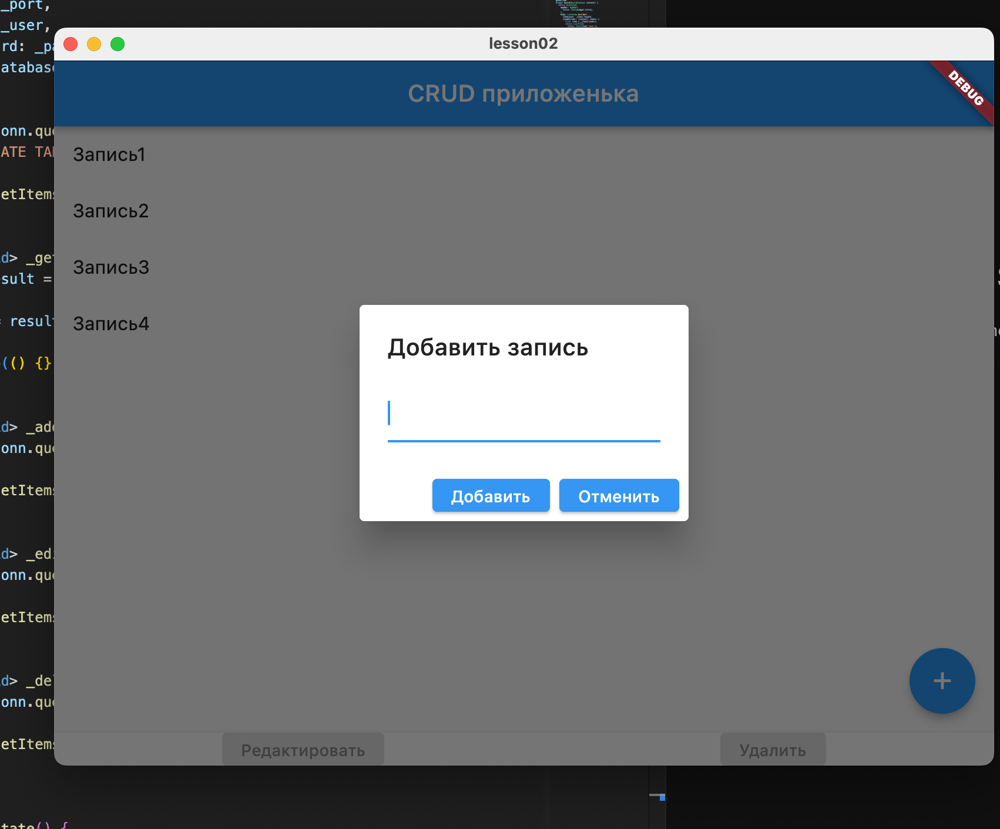
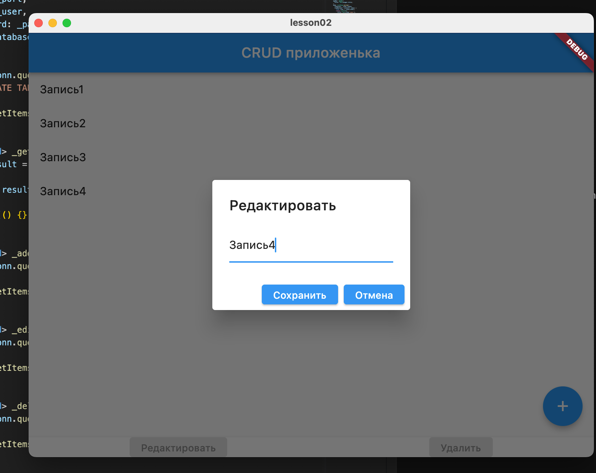
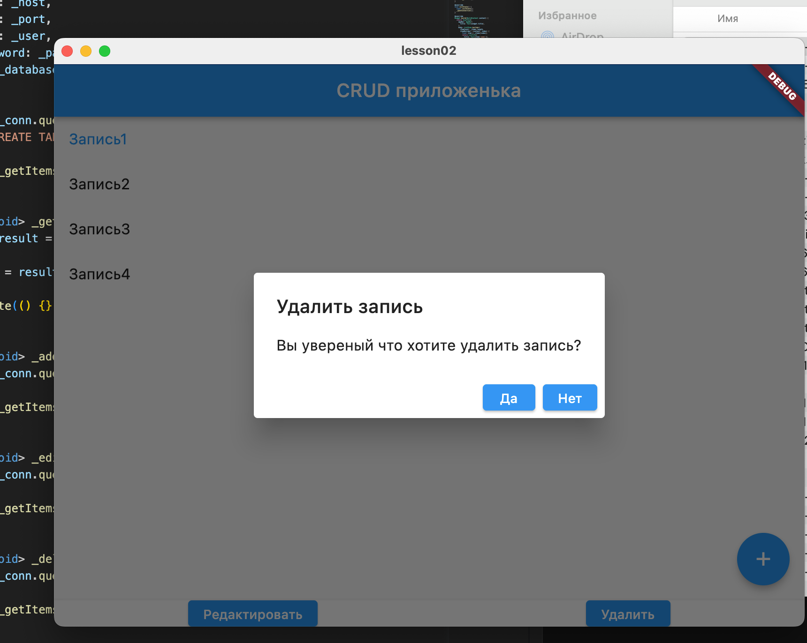

# Урок 2. SQL – создание объектов, простые запросы выборки

Используя операторы языка SQL, создайте табличку “sales”. Заполните ее данными.

Сгруппируйте значений количества в 3 сегмента — меньше 100, 100-300 и больше 300.

Создайте таблицу “orders”, заполните ее значениями. Покажите “полный” статус заказа, используя оператор CASE.

## Дополнительное задание к первым 2 урокам:

1. CRUD - операции на любом ЯП. Коннект с БД через С#, к примеру, можно попробовать сделать GUI (WindowsForms, Dear PyGui, PySide или любая другая библиотека).
2. Можно и НУЖНО гуглить :)

Файл со скриптом прикреплен к материалам(interview.sql):

№1. Используя оператор ALTER TABLE, установите внешний ключ в одной из таблиц (clients-posts)

№2. Без оператора JOIN, верните заголовок публикации, текст с описанием, идентификатор клиента, опубликовавшего публикацию и логин данного клиента.

№3. Выполните поиск по публикациям, автором которых является клиент "Mikle".

Конспект к 2 лекции: https://www.notion.so/SQL-2-d8ccb2206c9941b6acd594d06689abb7


# Домашнее задание:

```
CREATE TABLE sales (
  id INT PRIMARY KEY,
  order_date DATE,
  count_product INT
);

INSERT INTO sales (id, order_date, count_product)
VALUES (1, '2022-01-01', 156),
       (2, '2022-01-02', 180),
       (3, '2022-01-03', 21),
       (4, '2022-01-04', 124),
       (5, '2022-01-05', 341);
```

```
SELECT 
  CASE 
    WHEN count_product < 100 THEN 'Меньше 100' 
    WHEN count_product BETWEEN 100 AND 300 THEN '100-300' 
    ELSE 'Больше 300' 
  END AS count_segment, 
  COUNT(*) AS count_segment_count
FROM sales
GROUP BY count_segment;

```


```
CREATE TABLE orders (
  id INT PRIMARY KEY,
  employee_id VARCHAR(10),
  amount DECIMAL(10, 2),
  order_status VARCHAR(10)
);

INSERT INTO orders (id, employee_id, amount, order_status)
VALUES (1, 'e03', 15.00, 'OPEN'),
       (2, 'e01', 25.50, 'OPEN'),
       (3, 'e05', 100.70, 'CLOSED'),
       (4, 'e02', 22.18, 'OPEN'),
       (5, 'e04', 9.50, 'CANCELLED');

```

```
SELECT 
  id, 
  employee_id, 
  amount, 
  order_status, 
  CASE 
    WHEN order_status = 'OPEN' THEN 'Order is in open state'
    WHEN order_status = 'CLOSED' THEN 'Order is closed'
    WHEN order_status = 'CANCELLED' THEN 'Order is cancelled'
    ELSE 'Unknown order status'
  END AS full_order_status
FROM orders;
```


# Дополнительное задание 1:
Код на flutter в репозитории

Учусь на мобильного разработчика

использзуем пакет mysql1

вот скрины:


[](./assets/add.png)
[](./assets/edit.png)
[](./assets/delete.png)


# Дополнительное задание 2: 
```
ALTER TABLE posts
ADD CONSTRAINT posts_user_id_fkey
FOREIGN KEY (user_id)
REFERENCES users (id);
```
```
SELECT title, full_text, user_id, users.login
FROM posts, users
WHERE posts.user_id = users.id;
```
```
SELECT *
FROM posts
WHERE user_id = (
    SELECT id
    FROM users
    WHERE login = 'Mikle'
);
```